# Camera CTR - High-Speed & Lightning Photography Trigger

### Description
**Arduino-based camera trigger for high-speed lightning photography. Features include auto-threshold light sensors, sound triggers, time-lapse, long exposure, and interval timers. Developed in 2015, this field-tested prototype uses an LCD interface and EEPROM to store settings for professional storm chasing.**

## Prototype & Hardware Design
The device evolved through several iterations, from early breadboard tests to a finalized prototype with a dedicated housing. 

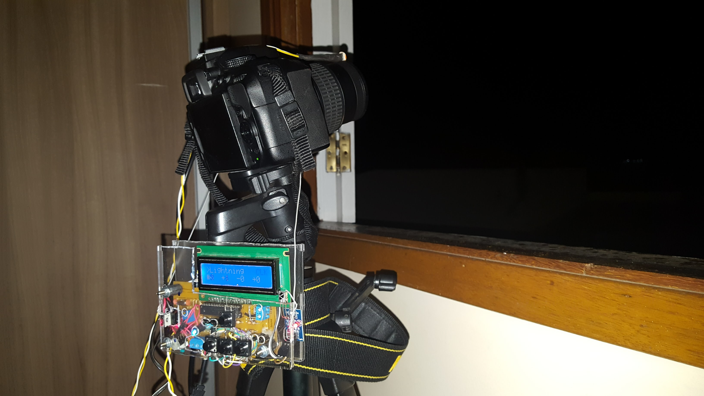

### Hardware Schematics
Although the custom PCB was not manufactured, the project includes complete design files for the circuit and board layout.

| Breadboard View | Schematic | PCB Design (Unfabricated) |
| :---: | :---: | :---: |
|  |  |  |

## Features
* **Lightning Auto-Trigger**: Automatically calculates sensitivity thresholds based on ambient light to capture strikes.
* **Lightning Manual Mode**: Manual adjustment of light sensitivity for specific conditions.
* **Sound Sensor Trigger**: Fires the camera based on acoustic events with adjustable sensitivity.
* **Time-Lapse Mode**: Captures sequences with programmable intervals up to 30 seconds.
* **Long Exposure Controller**: Precision shutter control for exposures up to 120 seconds.
* **Interval Timer**: Countdown timer for delayed photography.
* **Manual Mode**: Standard digital remote shutter functionality.

## Hardware Configuration
The project is built on the Arduino platform using an ATmega chip and a 16x2 LCD. 
The pin mapping as defined in the source code is:

| Component | Pin |
| :--- | :--- |
| **Camera Shutter (Trigger)** | 10 |
| **Ready/Status LED** | 9 |
| **Photometer (Light Sensor)** | A1 |
| **Sound Sensor** | A2 |
| **LCD Backlight Control** | A5 |
| **Keypad (Analog Buttons)** | A0 |

### LCD Pinout (LiquidCrystal)
* **RS**: 2, **Enable**: 3, **D4-D7**: 4, 5, 6, 7.

## Software Logic & Memory
The system utilizes the internal EEPROM to persist user settings across power cycles:
* **EEPROM 01**: Time Lapse Delay settings.
* **EEPROM 02**: Long Exposure parameters.
* **EEPROM 03**: Timer Delay.
* **EEPROM 04**: Lightning Manual Sensitivity.
* **EEPROM 05**: Sound Sensor Thresholds.

## Photo Gallery (Captured with Camera CTR)
Below are photos captured during storms, demonstrating the precision of the synchronized trigger with lightning discharges.

| | | |
|:---:|:---:|:---:|
|  | 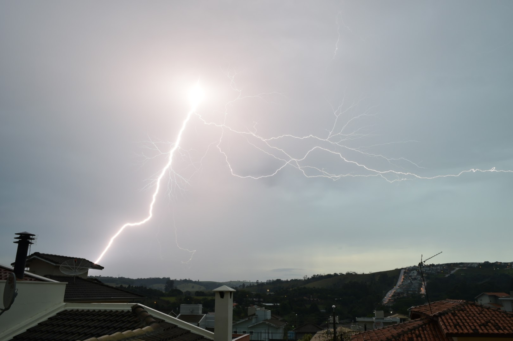 | 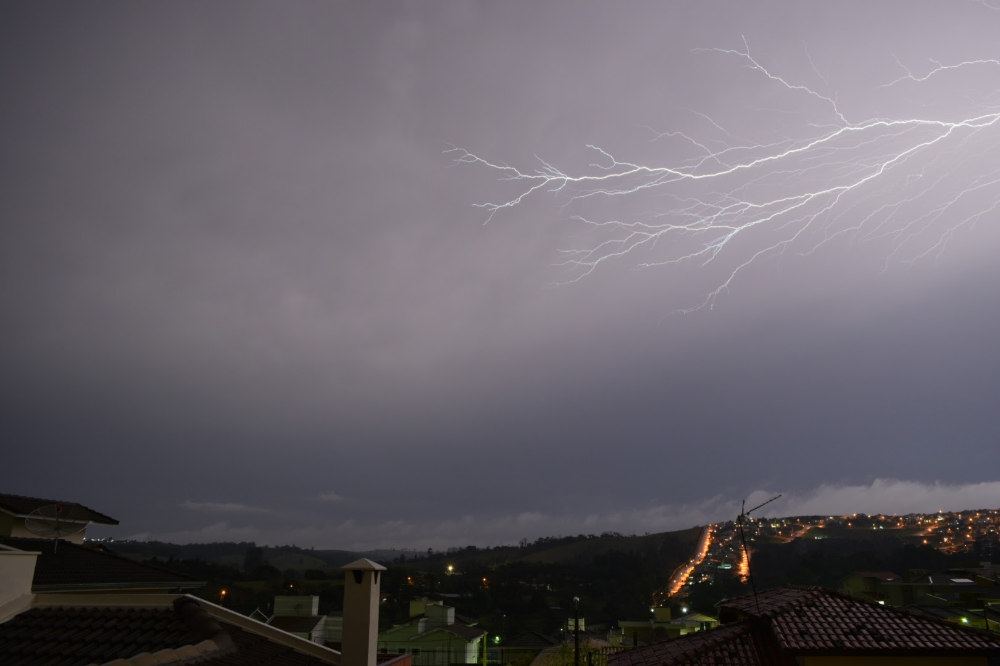 |
| 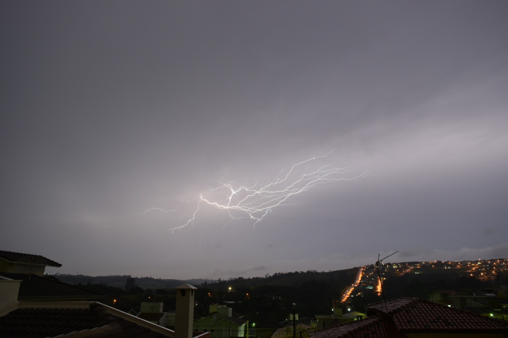 | 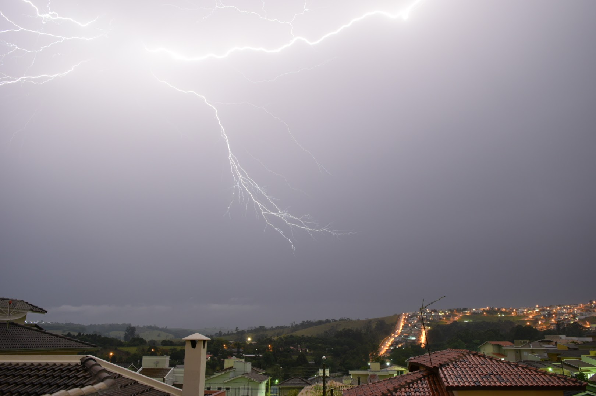 | 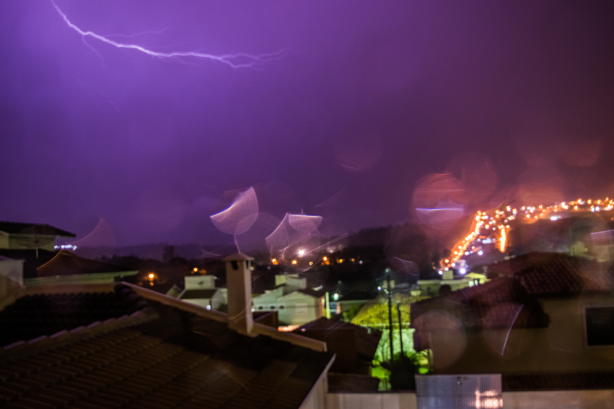 |
| 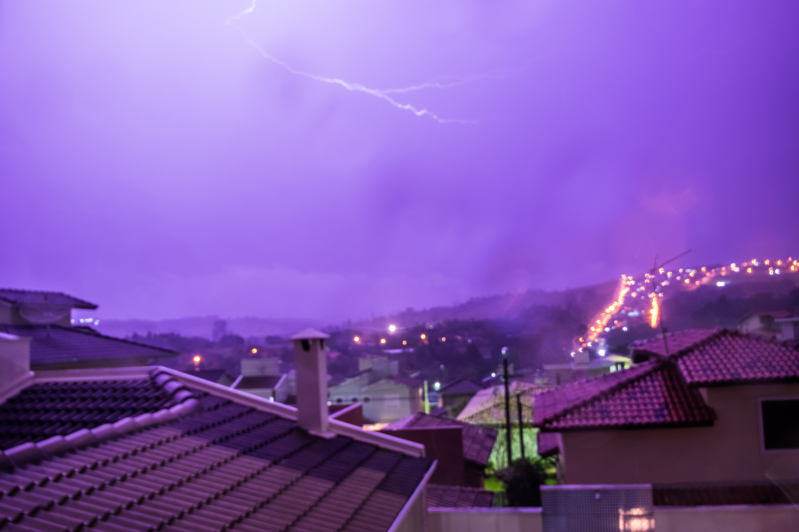 | 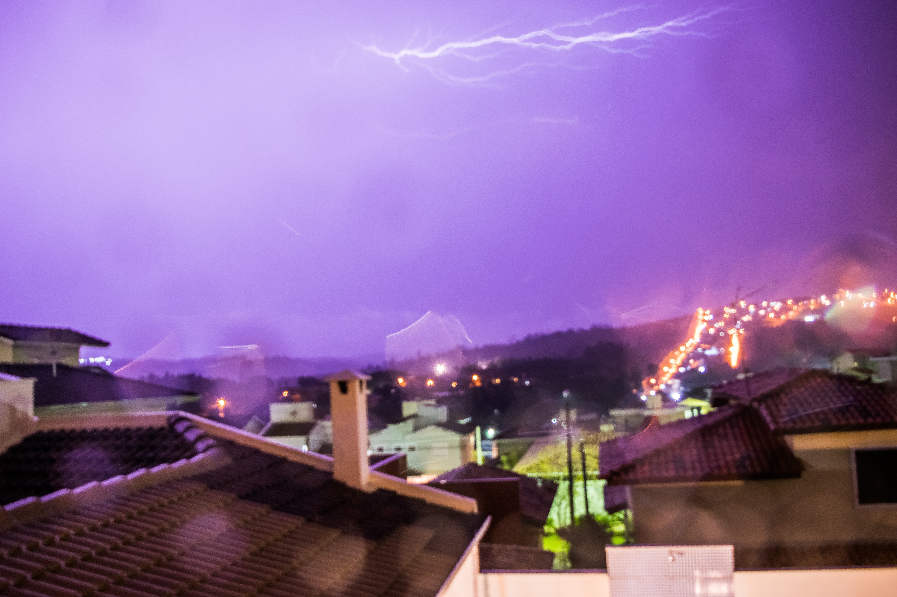 | 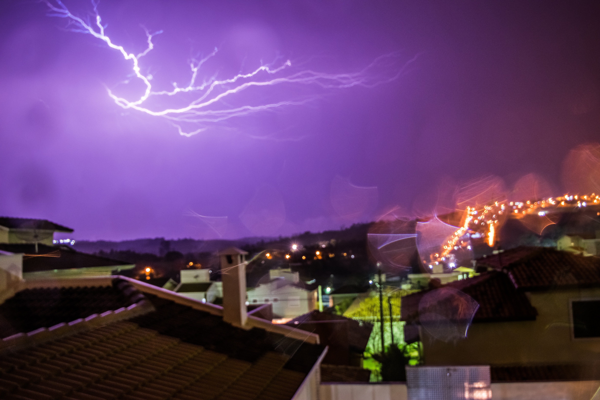 |
| 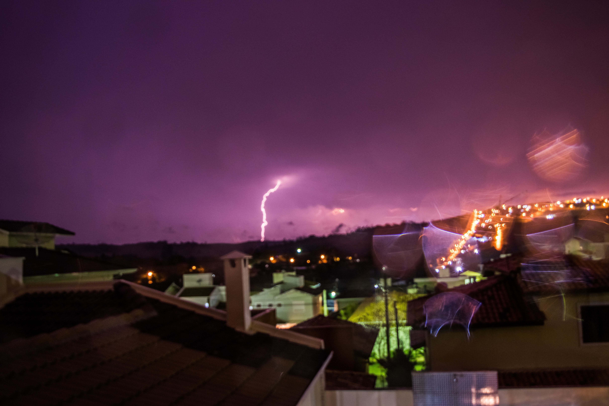 | 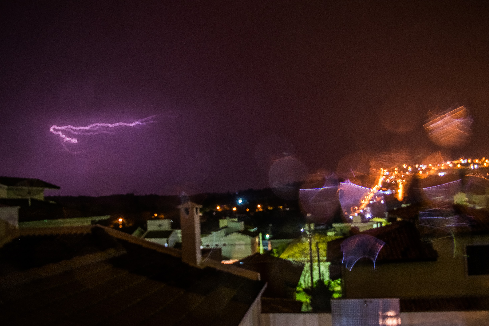 | 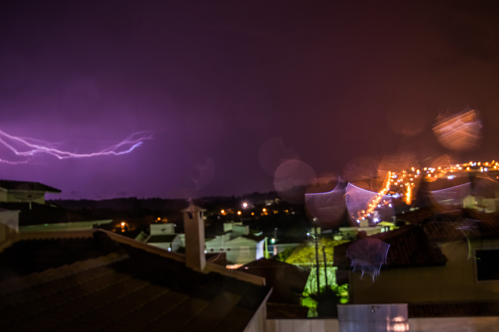 |
| 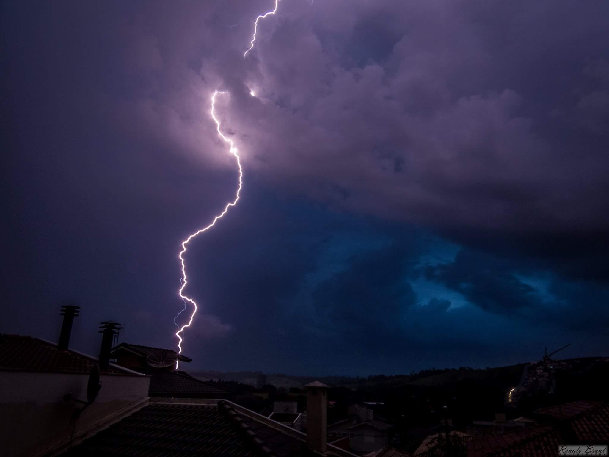 | 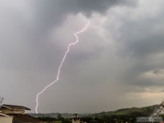 | 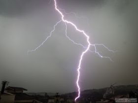 |

## Open Source & Contributions
This is an **open project**. You are free to copy, modify, and use it for your own photography projects. If you find this helpful or use it in your work, a citation or credit is greatly appreciated!

## Video Documentation
A comprehensive video series covers the hardware assembly, programming logic, and real-world field tests:

**[📺 Camera CTR Project - YouTube Playlist](https://www.youtube.com/playlist?list=PLX2YtMdpQuUke00zPxl_PeEOyKNRLNvi6)**

### Technical Highlights
* **Programming Logic**: Detailed breakdown of the Arduino code structure and menu navigation.
* **Field Testing**: Real footage of the sensor triggering the camera during lightning storms.

## Version History (2015-2016)
* **v0.1 - v0.3**: Initial counters for Time Lapse, Long Exposure, and Timer.
* **v0.5 - v0.7**: Implementation of Lightning Photo, threshold logic, and two-color LED.
* **v0.8 - v0.10**: Integration of Sound Sensor and timing corrections.
* **v0.12 - v0.16**: Final UI refinements, Manual Mode, and Backlight management.

---
*Project by Renato Brant.*
